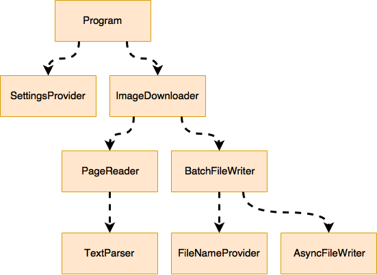

# Handling Dependencies

If you follow SOLID principles in your coding - 
and particularly the Single Responsibility Principle - 
than you will end up soon with a bunch of software units that
depend on each other.

The domain of this example is an image downloader - it downloads
all pictures referenced in a website. A possible decomposition
and dependency graph could look like this:



We are looking for possibilities for implementing 
such a dependency graph so that 
* it is easy to instantiate, and
* the units are loosely coupled, and can be replaced.

## Dependencies as functions

In functional languages the natural unit of composition is - the function.
These dependencies could be passed as arguments to the other function.

```scala
def downloadPageImages(getImageUrls: String => Set[String], downloadFiles: (Set[String], String) => Unit)
      (url: String, folder: String): Unit = {
    val imageUrls = getImageUrls(url)
    downloadFiles(imageUrls, folder)
}
```
